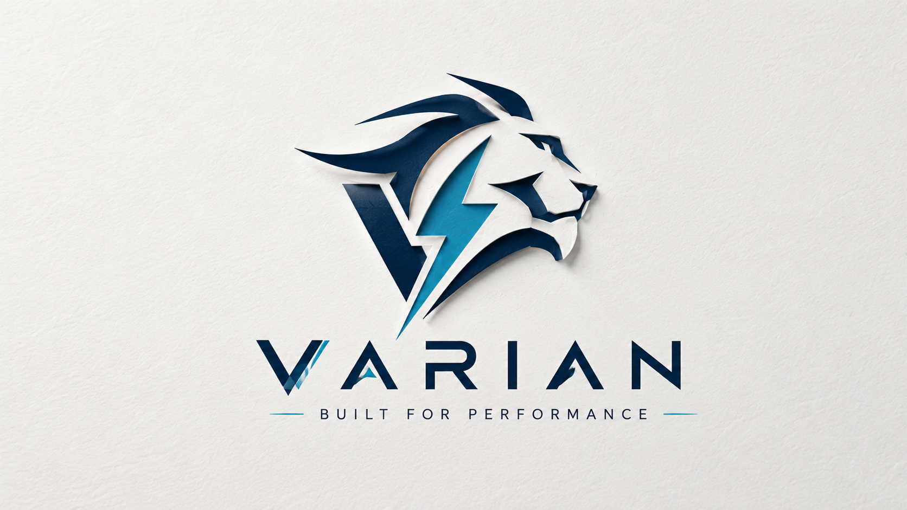
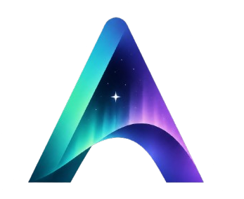

<p align="center">
  
</p>

<h1 align="center">Varian</h1>

<p align="center">
  A compiled, concurrent, systems-level programming language with a custom bytecode VM —
  batteries included, one binary, zero <code>node_modules</code>.
</p>

<p align="center">
  <a href="#quick-start">Quick start</a> ·
  <a href="#lumen--the-frontend-framework">Lumen</a> ·
  <a href="#aurora--the-fullstack-framework">Aurora</a> ·
  <a href="#zenith--the-web-framework">Zenith</a> ·
  <a href="#cli">CLI</a> ·
  <a href="#documentation">Docs</a>
</p>

---

## Why Varian

Most languages make you assemble a stack: a web framework, a template engine, a build tool,
a package manager, a formatter, a linter, a test runner, an ORM, an LSP server. Each is a
separate install, separate version, separate supply-chain surface.

Varian is **one binary** that is all of those things. The language runtime, the web
framework (Zenith), the frontend framework (Lumen), the build tool (Kiln), the package
manager (Constellation), the LSP server, the formatter, the linter, and the test runner
live in a single native executable. There is nothing to `npm install`, no `pip install`,
no `cargo install` — just `vn` and you're building web apps.

- **Go-style concurrency** — cooperative green-thread tasks, actors, channels
- **Batteries-included stdlib** — SQLite, Postgres, Redis, JWT auth, SMTP, validation,
  HTML templating, regex, sanitization, signed sessions, background queues, OpenAPI docs
- **Server-driven frontend** — Lumen renders HTML on the server, patches the DOM over a
  WebSocket; no client-side framework, no hydration mismatches, no `node_modules`
- **AOT compilation** — ship your app as a native binary via `vn build --release`

---

## Quick start

```sh
# Build the compiler
make

# Run a script
./vn run examples/hello.vn

# Start a new Aurora (fullstack) project
./vn new myapp
cd myapp
./vn dev              # http://localhost:8090 — live reload

# Scaffold a Lumen-only frontend
./vn lumen new myapp
cd myapp
./vn dev              # http://localhost:8090 — live reload

# Run tests
./vn test tests/

# Format code
./vn fmt .

# Start the LSP (for VS Code, Neovim, Zed, etc.)
./vn lsp
```

---

## Lumen — the frontend framework

<p align="center">
  
</p>

<p align="center"><i>Server-driven. Live by default. Zero config, zero <code>node_modules</code>, zero hydration mismatch.</i></p>

Lumen is a full-stack UI framework that ships *inside the `vn` binary* — Varian's answer to
Next.js and Nuxt. You write `.lumen` components, run `vn dev`, and you have a live,
reactive app.

> **Lumen : Varian :: JSX : TypeScript.** A `.lumen` file is markup + bindings; the logic
> underneath is plain Varian (`.vn`).

### The core idea: server-driven live

Most React/Next apps run your component logic *twice* — once on the server (SSR) and again
in the browser (hydration) — which is the entire source of the dreaded "hydration mismatch"
class of bugs. Lumen does not do this.

In Lumen, **the server owns all state and does all rendering.** The browser runs a tiny
runtime whose only jobs are: forward DOM events over a WebSocket, and patch the DOM with
whatever HTML the server sends back. State lives in plain Varian on the server — no
`useState`, no `useEffect` dependency arrays, no stale closures, no `useMemo` ceremony.

```
┌────────── Browser ──────────┐         ┌────────────── Server (Varian) ──────────────┐
│  click ─▶ data-lumen-click  │ ──WS──▶ │  run handler ▶ new state ▶ re-render HTML    │
│  morph DOM ◀── DOM patch ── │ ◀──WS── │  diff vs last HTML ▶ send minimal splice     │
└─────────────────────────────┘         └──────────────────────────────────────────────┘
```

Because the server renders the *real* HTML on every change, **SSR and SPA-grade
interactivity are the same mechanism** — there is nothing to "hydrate," so there is no
mismatch to debug.

### Anatomy of a `.lumen` component

```html
<template>
  <main style="display:grid;place-items:center;min-height:100vh">
    <svg @click="pulse" viewBox="0 0 48 48" width="150">
      <rect x="3" y="3" width="42" height="42" rx="12" fill="#1b2233"/>
      <path d="M26 7 L15 27 h7 L19 41 L33 21 h-8 L29 7 Z"
            fill="{{ color }}" style="transition:fill .35s ease"/>
    </svg>
    <p>pulse <b>{{ count }}</b></p>
  </main>
</template>

<script>
fn _hue(n) {
  let palette = ["#f5b829", "#ff6b6b", "#4dd4ac", "#5b9cff", "#c77dff", "#ff9f43"]
  return palette[n % 6]
}
fn state() { return { count: 0, color: "#f5b829" } }
fn pulse(s, v) {
  let n = s.get("count") + 1
  return s.set("count", n).set("color", _hue(n))
}
</script>
```

Click the logo → the server runs `pulse` → computes a new colour → re-renders → Lumen
morphs **only the changed `fill` attribute** into the live DOM.

### Markup syntax

| Syntax | Meaning |
| --- | --- |
| `{{ expr }}` | Interpolate, **HTML-escaped by default** (XSS-safe) |
| `{{! expr }}` | Interpolate raw / unescaped (trusted content only) |
| `{{#if expr}} … {{else}} … {{/if}}` | Conditionals |
| `{{#each items as item}} … {{/each}}` | Loops |
| `@click="handler"` | Live event hook (also `@input`, `@change`, `@submit`, `@keydown`, …) |
| `<UserCard id="u1" name="Ada" />` | Child component with props |
| `<Card> … </Card>` + `{{! children }}` | Slots |
| `<client> … </client>` | Browser-only JS island (charts, maps, canvas) |

### Dev console

```text
   LUMEN   v0.1.0   the Varian frontend framework

  ➜  Local     http://localhost:8090/
  ➜  Pages     2 in pages/

     ● /                  index.lumen
     ● /about             about.lumen

  ✔ ready in 142 ms  · watching pages/ — edit a page to hot-reload
```

- **File-based routing.** Drop `pages/index.lumen` → served at `/`.
- **Live reload.** Save a file → server rebuilds → browser auto-reconnects.
- **Error overlay.** Runtime errors show a branded in-browser overlay with file/line/caret
  and a fix hint.
- **Batteries included.** Favicons, manifest, responsive viewport, Degular typeface —
  all scaffolded by `vn lumen new`.

### Lumen vs React / Next / TypeScript

| React / Next / TS pain | Lumen's answer |
| --- | --- |
| Config & build hell (tsconfig, webpack/vite/babel, dozens of deps) | **Zero-config.** One binary, `vn dev`, nothing to wire. |
| Hydration mismatches, SSR/CSR divergence | **Server-driven live** — the server renders; no client/server divergence. |
| `node_modules` + supply-chain risk | **Batteries-included**, ships in the binary. No npm, no lockfile. |
| Reactivity footguns (effect deps, stale closures, memo ceremony) | State is plain Varian on the server. No dependency arrays, no stale closures. |
| XSS-by-omission (forgot to escape) | `{{ }}` **escapes by default**; raw is the explicit `{{! }}`. |
| Cryptic wall-of-text errors | Friendly errors with file/line/caret + a fix hint, branded browser overlay. |
| Fragmented commands (npm/npx/tsc/eslint/jest/vite) | One `vn` CLI with consistent verbs — same DX as the backend. |

### CLI

```sh
vn lumen new myapp       # Scaffold pages/ + public/ + starter component
vn dev                   # Serve ./pages with live reload (default :8090)
vn dev pages 3000        # Custom dir + port
vn lumen build pages app.vn 8090   # Compile pages/ into one runnable app
```

---

## Aurora — the fullstack framework

<p align="center">
  
</p>

Aurora combines Zenith (server) and Lumen (frontend) into one unified project structure.
It is Varian's answer to Next.js / Nuxt / Rails — a single framework that spans database
to browser.

```sh
vn new myapp          # Scaffold a full Aurora project
cd myapp
vn dev                # http://localhost:8090 — live reload
vn build --release    # Compile to a native binary
```

An Aurora project has code examples, real-world demo apps (product catalog, cart,
checkout, auth), and the full Aurora-vs-Next.js comparison at
[`/aurora`](https://varian.sh/aurora).

---

## Zenith — the web framework

<p align="center">
  
</p>

Zenith is Varian's built-in HTTP web framework — a non-blocking, `io_uring`-powered
server that lives inside the `vn` binary. It handles routing, WebSockets, middleware,
CORS, CSRF, rate limiting, sessions, static file serving, TLS, and OpenAPI docs.

```swift
let app = new_app()

app.get("/users/:id", |req| {
    let user_id = req.params["id"]
    return Response {
        status: 200,
        body: json_encode({ "user": user_id, "status": "active" }),
        content_type: "application/json"
    }
})

app.listen(3000)
```

- **Batteries included.** SQLite, Postgres, Redis, JWT auth, SMTP, validation, HTML
  sanitization, regex, background queues, signed sessions — all built in, zero deps.
- **No imports.** Everything in `vn_modules/` is auto-loaded. You write `new_app()` and
  `app.get(...)` — no `require`/`import`, no plugin registration.
- **Per-request arenas.** Memory for each request lives in a task-local arena; when the
  request ends, memory is bulk-reclaimed by resetting a pointer — zero GC overhead.
- **Radix trie routing.** Routes resolve in O(path segment) trie descent.
- **WebSockets & SSE.** Real-time communication, no external dependencies.
- **AOT compilation.** `vn build --release` compiles your app to a native C binary.

See [`docs/ZENITH.md`](docs/ZENITH.md) for the full reference.

---

## Kiln — the build tool

<p align="center">
  
</p>

Kiln (`vn build`) compiles Varian applications into single-file artifacts. It
auto-detects project structure (pages/ → Lumen mode), embeds `public/` assets directly
into the output, and can produce a native binary via `--release`.

```sh
vn build                    # Bundle into a .vnb
vn build --release          # Compile to a native C binary
```

See [`docs/KILN.md`](docs/KILN.md).

---

## Constellation — the package manager

<p align="center">
  
</p>

Constellation (`vn add`/`vn remove`/`vn search`/`vn install`/`vn publish`) is Varian's
built-in package management. It uses a hybrid CDN index + git vendoring model —
no central registry to maintain, no npm-style supply-chain attack surface.

```sh
vn add my-lib          # Record a dependency
vn install             # Fetch and vendor all deps
vn publish             # Publish a package
```

See [`docs/CONSTELLATION.md`](docs/CONSTELLATION.md).

---

## CLI

```
vn                      Start interactive REPL
vn run <file>           Execute a Varian script
vn fmt <file>           Format a Varian script in-place
vn test [dir]           Run *_test.vn tests (default: .)
vn lint [path]          Lint a file or directory
vn add <pkg>            Add a package dependency
vn remove <pkg>         Remove a package
vn install [--frozen]   Install dependencies
vn update               Update dependencies
vn search <q>           Search the registry
vn publish              Publish a package
vn build <file>         Build a .vnb or --release native binary
vn lsp                  Start the LSP server
vn new <name>           Scaffold an Aurora project
vn dev [dir] [port]     Serve with live reload (default ./pages :8090)
vn lumen new <name>     Scaffold a Lumen-only frontend
vn lumen add <comp>     Copy a Lumen UI component
vn lumen build <dir> <out>   Compile pages/ into one runnable app
```

---

## Architecture

Source → Lexer → Parser → AST → Compiler → Bytecode → VM

All frontend allocations use a fast arena allocator. The bytecode VM is a register-style
stack machine with heap-allocated objects and a deeply integrated cooperative green-thread
scheduler (tasks, actors, channels). Long-lived objects are managed by a mark-and-sweep
GC; short-lived request allocations use task-local bump arenas.

---

## Documentation

| Doc | What it covers |
| --- | --- |
| [`docs/LANGUAGE.md`](docs/LANGUAGE.md) | Core language — types, functions, structs, generics, enums, traits, error handling, decorators, comptime, FFI |
| [`docs/CONCURRENCY.md`](docs/CONCURRENCY.md) | Tasks, channels, actors |
| [`docs/STDLIB.md`](docs/STDLIB.md) | Native modules — math, string, regex, SQLite, Postgres, Redis, HTTP, auth, validate, SMTP, JSON, Python bridge, FFI |
| [`docs/ZENITH.md`](docs/ZENITH.md) | The Zenith web framework |
| [`docs/LUMEN.md`](docs/LUMEN.md) | The Lumen frontend framework — components, events, slots, islands |
| [`docs/KILN.md`](docs/KILN.md) | Kiln build tool — bundling, AOT, asset embedding |
| [`docs/CONSTELLATION.md`](docs/CONSTELLATION.md) | Constellation package manager — registry, vendoring, publishing |
| [`docs/TOOLING.md`](docs/TOOLING.md) | `vn` CLI reference — all commands, environment variables, module loading |
| [`docs/SECURITY.md`](docs/SECURITY.md) | Threat model, hardened build, app-level defenses |
| [`docs/DEPLOYMENT.md`](docs/DEPLOYMENT.md) | Releasing, editor extensions, hosting the website |

---

## Building

```sh
make
./vn run examples/hello.vn
```

Requires: `build-essential`, `libcurl4-openssl-dev`, `libssl-dev`, `libsqlite3-dev`,
`libpq-dev`, `libhiredis-dev`, `libffi-dev`, `liburing-dev`.

---

## Editor support

- **VS Code** — `editors/vscode/` is a complete extension (syntax highlighting + LSP
  client + file icons for `.vn`/`.lumen`). `npx vsce package` produces a `.vsix`.
- **Zed** — LSP works via `editors/zed/`; highlighting needs a `tree-sitter-varian` grammar.
- **Neovim / any LSP client** — point at `vn lsp`.
