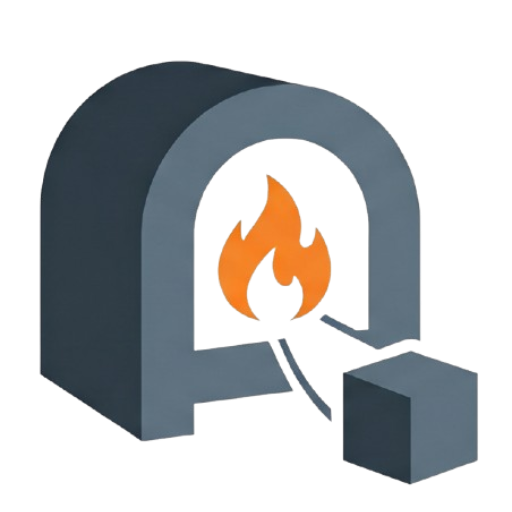

<p align="center">
  
</p>

# Kiln — The Varian Build Tool

**Kiln fires raw Varian into a hardened, shippable artifact.**

Kiln is the unified compilation and build orchestrator for Varian applications. It reads project settings from `constellation.toml`, resolves dependency graphs offline using `constellation.lock`, and bundles application logic and assets into single-file deliverables.

---

## 1. Zero-Config Build Philosophy

Kiln eliminates build configuration file sprawl (such as webpack, vite, or tsconfig files) by standardizing on sensible defaults.
* **Auto-Discovery**: If a `pages/` directory exists, Kiln enters Lumen framework mode, compiling pages into routes.
* **Asset Embedding**: The `public/` directory (static assets, icons, fonts) is automatically embedded directly inside the output bundle or binary.
* **Offline Execution**: Kiln never reaches out to the network. It assumes the offline state of `vn_modules/` represents the truth established by the package manager.

```
                      constellation.lock
                               │
   Varian Source Code          ▼
   (main.vn, pages/*.lumen) ──▶[Assemble]
                               │
               ┌───────────────┴───────────────┐
               ▼                               ▼
       Portable Bundle                  AOT Native Binary
       (Default)                        (--release)
               │                               │
               ▼                               ▼
          `app.vnb`                        `./app`
   - Serialized bytecode            - C Code AOT Compilation
   - Embedded public/ assets        - Linked against libvarian.a
   - Immediate startup              - Standalone binary execution
```

---

## 2. Compilation Backends

### Backend A: Portable Bytecode Bundle (`vn build`)
This is the default output backend, producing a single `app.vnb` bytecode container:
* **The `.vnb` Format**: Contains a versioned header (specifying language ABI and VM version gates), serialized function chunks (bytecode instruction vectors and constant pools), a string table, and embedded assets.
* **Startup Performance**: When executing `vn app.vnb`, the VM skips lexing, parsing, and bytecode generation entirely, reading bytecode arrays straight into execution structures.
* **Compatibility Gate**: A `.vnb` bundle compiled by an incompatible Varian VM version is caught at the header level and rejected, preventing unsafe execution or memory corruption.

### Backend B: Standalone Native Binary (`vn build --release`)
This backend produces a compiled, optimized native executable for the target machine:
1. **AOT C Generation**: Drives `aot_compile()` (from `src/aot.c`) to turn Varian source code into equivalent native C structures representing Varian execution logic.
2. **Harness Generation**: Emits a `main()` C harness that sets up the Varian runtime, instantiates the VM, loads the AOT function table (`varian_aot_load(vm)`), and executes the entry point.
3. **Compilation & Linking**: Invokes the C compiler to compile the generated C code and link it against `libvarian.a` (the archived Varian runtime library) and its associated system dependencies:
   `cc -O2 -Iinclude app.c -o app libvarian.a -lm -lffi -ldl -lcurl -lpq -lcrypto -lssl -lsqlite3 -lhiredis -lpthread -luring`
4. **Static and Cross-Compilation (K5)**: 
   - `--static`: Passes the `-static` flag to the underlying C compiler to produce a fully statically-linked binary (e.g., using musl-libc or explicitly provided static dependency archives).
   - `--target=<triple>`: Passes the `-target <triple>` flag to the C compiler, allowing for cross-compilation when used with a compatible compiler (like clang or zig cc).
   - `--cc=<compiler>`: Overrides the C compiler executable (e.g., `--cc=zig cc` or `--cc=aarch64-linux-gnu-gcc`). Alternatively, use the `$CC` environment variable.
5. **Embedded Assets**: Embeds assets directly in the binary layout so the application runs standalone.

---

## 3. Incremental Build Caching

To ensure rapid compilation, Kiln maintains a content-addressed build cache under `.kiln/cache/`:
* **Cache Keys**: Built from the combined FNV-1a hash of:
  - The literal bytes of the Varian source code.
  - The values of all active compiler flags (`--release`, `--static`, `--cc`, `--target`).
  - The bytes of all embedded assets found in the `public/` directory.
* **Unchanged Modules**: If the computed 64-bit hash matches an existing file in `.kiln/cache/`, Kiln bypasses the entire parser and compiler, immediately copying the cached artifact to the output destination. This reduces repeated compilation times of large projects from seconds to milliseconds.
* **Reproducibility**: The cache is purely a speed optimization. If you delete `.kiln/`, or run the build on a completely fresh machine (assuming the same `constellation.lock` and source files), Kiln is mathematically guaranteed to yield a byte-for-byte identical output artifact.

---

## 4. Lumen Framework Integration

Kiln is deeply aware of **Lumen**, Varian's web framework. If Kiln detects a `pages/` directory in the current working directory, it automatically shifts into "Lumen App Mode".

1. **Pre-compilation of Routes**: Kiln triggers `lumen_build()`, which traverses the `pages/` directory and transpiles the `.lumen` HTML/Varian templates into pure Varian functions (`.lumen-build.vn`).
2. **Asset Routing**: If a `public/` directory exists, Kiln embeds it. The Lumen runtime automatically serves these embedded assets at the root `/` path (e.g., `public/favicon.ico` becomes accessible at `https://your-app.com/favicon.ico`).
3. **Seamless Deployment**: By running `vn build --release`, your entire web server—including all HTML views, CSS stylesheets, images, and server-side Varian logic—is compiled into a single static C binary. You can deploy this single file to a bare Ubuntu server and run it without installing Nginx, Node.js, or even Varian itself.
